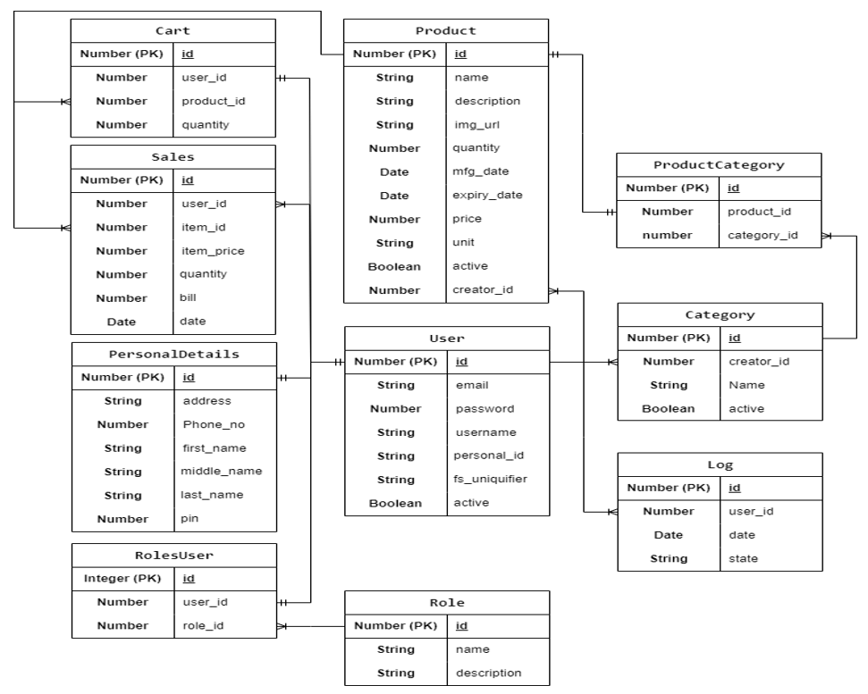

# BasketBuddy
Arju Mukherjee

I am currently pursuing B.Tech Degree from NATIONAL INSTITUTE OF ELECTRONICS AND INFORMATION TECHNOLOGY, Aurangabad and simultaneously attending the IITM online degree course.

## Description
In this project we are required to integrate flask, celery and other different applications with different databases as Redis and SQLite to successfully create a secure web application. We are making a user friendly web application for Store managers and the customers.

## Technologies used

In this project we use Flask framework, SQLite database, Redis, Flask-security, Flask-Restful, Flask SQLAlchemy, Flask-Celery, Flask-excel and other libraries.

The Flask framework is used to setup the web application, SQLite database is used for storing data, Redis database is used for caching and to store the result backend, Flask-security is used for securing the routes from unauthorized access, Flask-Restful is used to integrate REST api in the application, Flask-SQLAlchemy is used to query the SQLite database, Flask-Celery is used to perform jobs in different threads with the help of Celery, Flask-excel is used to export the data in csv formal, etc.

## DB Schema Design



It provides the necessary relations to smoothly extract information through the database

## API Design

There are many resources in the API namely Portal, Manager, Product, Categories, Cart and Downloads

## Architecture and Features

There are five folders and other files in the code folder. The application folder contains all the application backend interface, the GroceryApp folder contains the virtual environment, the instance folder contains the database, static folder contains the image files and JavaScript files and the template folder contains the html pages.

The static and templates folder contains the frontend application and the application and GroceryApp folders contain the backend applications.

## Environment

To use virtual environment use python venv.

For Windows:
```bash
python -m venv .venv
.venv/Scripts/activate
```
For Linux(Ubuntu):
```bash
python -m venv .venv
source .venv/bin/activate
```

## Installation

Use the package manager [pip](https://pip.pypa.io/en/stable/) to install requirements.

```bash
pip install -r requirements.txt
```

## Usage

```python
# Run the main file.
python main.py
```
It will open a server at [localhost:5000](https://127.0.0.1:5000)

## Contributing

Pull requests are welcome. For major changes, please open an issue first
to discuss what you would like to change.
Please make sure to update tests as appropriate.

